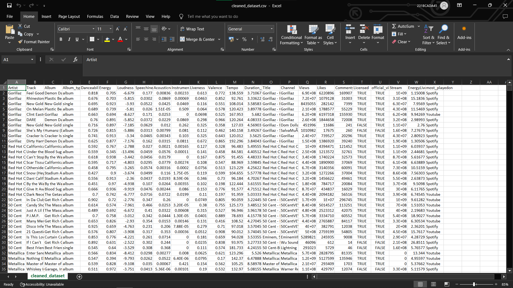
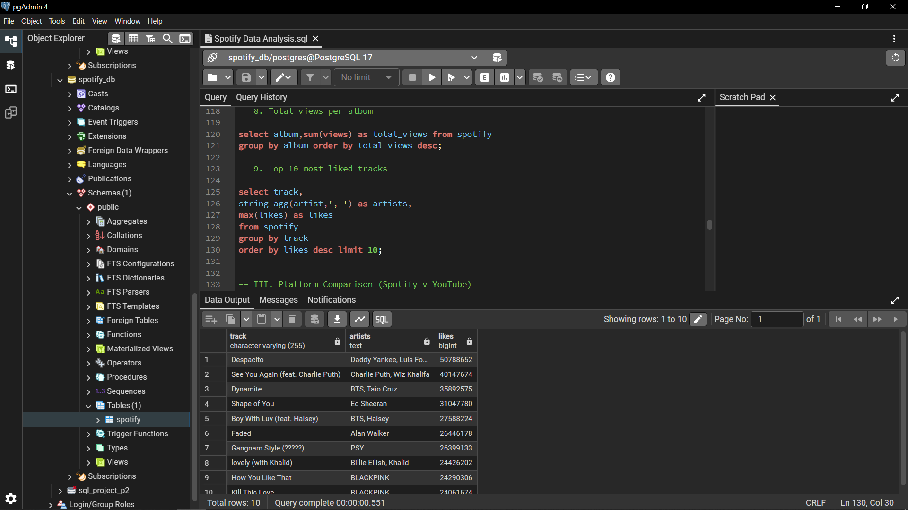
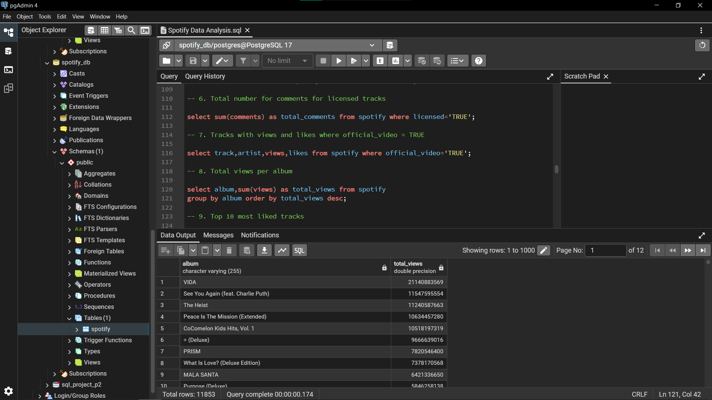
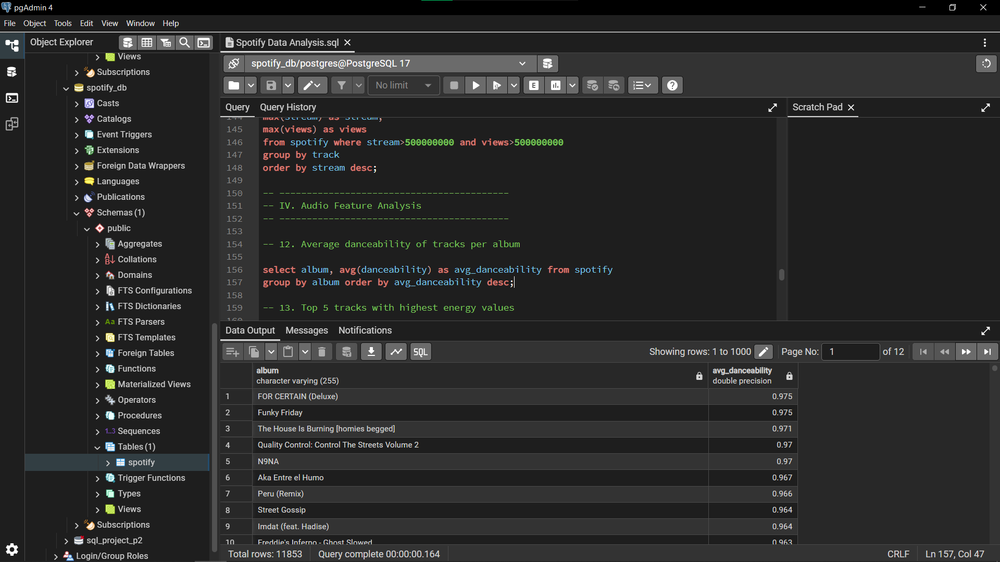
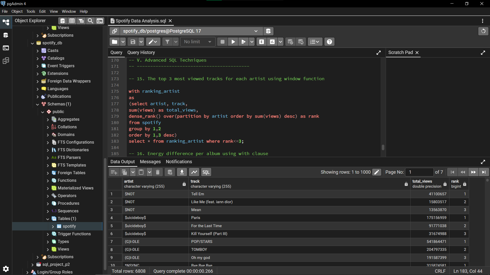

# Spotify SQL Analysis
Dataset from [Kaggle](https://www.kaggle.com/datasets/sanjanchaudhari/spotify-dataset)


## Overview
This project explores a Spotify dataset using SQL in PostgreSQL to perform exploratory data analysis (EDA) and derive insights related to music trends, artist performance, and audience engagement.

The goal of this project is to demonstrate strong SQL fundamentals along with the ability to extract meaningful insights from real-world data.

## Tools & Technologies

* PostgreSQL
* pgAdmin
* SQL (Aggregations, Joins, Window Functions, CTEs)

## Dataset Description
* Artist and track details
* Album and album type (single/album)
* Audio features (danceability, energy, liveness, etc.)
* Engagement metrics (views, likes, comments)
* Platform performance (Spotify streams vs YouTube views)

## Exploratory Data Analysis (EDA)

Performed initial analysis to understand dataset structure and quality:

* Counted total records and unique artists
* Identified available album types and distribution channels
* Explored platform usage (Spotify vs YouTube)
* Detected and removed invalid records (e.g., zero-duration tracks)
* Analyzed range of track durations

## Data Analysis

### I. Dataset Overview

* Mapped relationships between artists and albums
* Identified most productive artists
* Analyzed distribution of single vs album releases
* Determined artists with the highest number of albums

### II. Engagement & Popularity Analysis

* Identified tracks with over 1 billion streams
* Measured engagement on licensed content
* Compared views and likes for official videos
* Evaluated album-level popularity
* Ranked top tracks based on likes

### III. Platform Comparison (Spotify vs YouTube)

* Compared track performance across platforms
* Identified tracks performing strongly on both Spotify and YouTube

### IV. Audio Feature Analysis

* Analyzed average danceability across albums
* Identified high-energy tracks
* Filtered tracks with above-average liveness

### V. Advanced SQL Techniques

* Used **window functions** to rank top tracks per artist
* Applied **CTEs (Common Table Expressions)** for advanced calculations
* Measured variation in energy levels across albums

## Featured SQL Queries

The following queries highlight some of the key SQL techniques used throughout the project, including aggregations, data transformation, Common Table Expressions (CTEs), and window functions.

### Top 10 Most Liked Tracks

Identifies the tracks with the highest audience engagement while accounting for artist collaborations.

```sql
select track,
string_agg(artist,', ') as artists,
max(likes) as likes
from spotify 
group by track
order by likes desc limit 10;
```

---

### Tracks Performing Well on Both Spotify and YouTube

Finds tracks that achieved strong performance across both streaming platforms.

```sql
select track,
string_agg(distinct artist,', ') as artists,
max(stream) as stream,
max(views) as views 
from spotify where stream>500000000 and views>500000000
group by track
order by stream desc;
```

---

### Top 3 Most Viewed Tracks per Artist

Uses a window function to rank tracks by views within each artist's catalog.

```sql
with ranking_artist
as
(select artist, track, 
sum(views) as total_views,
dense_rank() over(partition by artist order by sum(views) desc) as rank
from spotify
group by 1,2
order by 1,3 desc)
select * from ranking_artist where rank<=3;
```

---

### Energy Variation Across Albums

Uses a Common Table Expression (CTE) to compare the range of energy levels within albums.

```sql
with cte
as
(select album,
max(energy) as highest_energy,
min(energy) as lowest_energy
from spotify
group by 1)
select album, highest_energy-lowest_energy as energy_diff 
from cte order by 2 desc;
```

---

### Average Danceability by Album

Analyzes how danceable tracks are on average across different albums.

```sql
select album, avg(danceability) as avg_danceability from spotify
group by album order by avg_danceability desc;
```

## Project Screenshots

### Dataset Preview



### Query 9: Top 10 Most Liked Tracks



### Query 8: Album Popularity Analysis



### Query 12: Average Danceability by Album



### Query 15: Top 3 Most Viewed Tracks per Artist



## Data Considerations

* Some tracks appear multiple times due to **artist collaborations**
* To ensure accurate analysis, tracks were aggregated where necessary and artist names were combined
* Data cleaning was performed by removing invalid records (e.g., duration = 0)

## Key Insights

* A small number of tracks dominate total streams, indicating a skewed popularity distribution
* Official videos tend to generate higher engagement (likes and views)
* High-energy tracks often appear among the most viewed content
* Several tracks perform strongly across both Spotify and YouTube platforms
* Artist collaborations can significantly impact track visibility and performance

## Conclusion

This project demonstrates the use of SQL for real-world data analysis, including:

* Data cleaning and validation
* Exploratory data analysis
* Aggregations and filtering
* Advanced SQL techniques (window functions and CTEs)

## How to Use

1. Import the dataset into PostgreSQL
2. Run the SQL script in pgAdmin
3. Explore queries and modify them for further analysis

## Author

Samuel Rajendran
